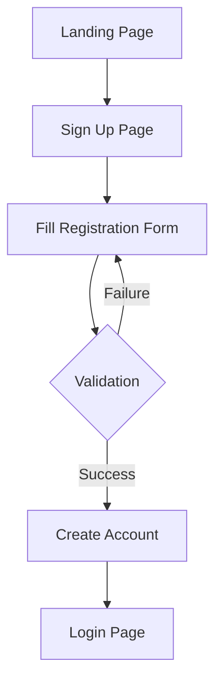
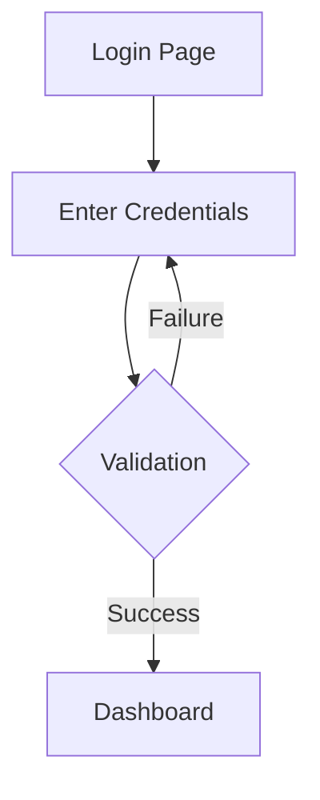
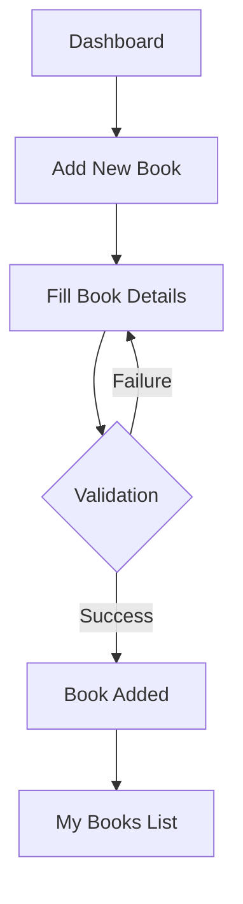
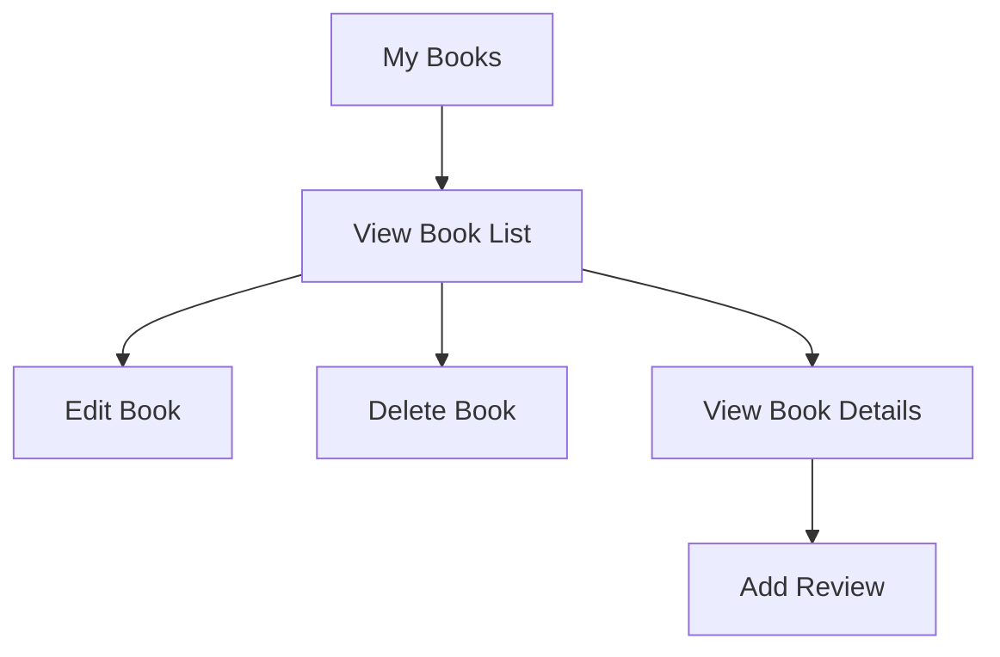
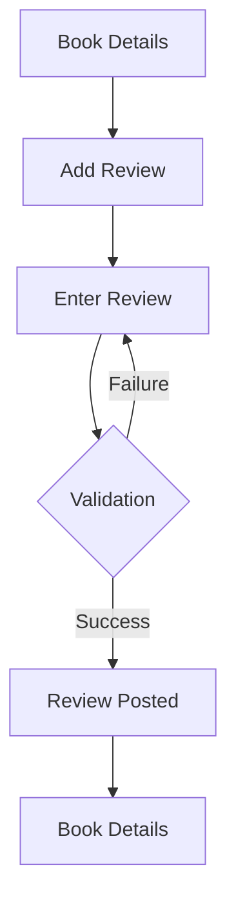
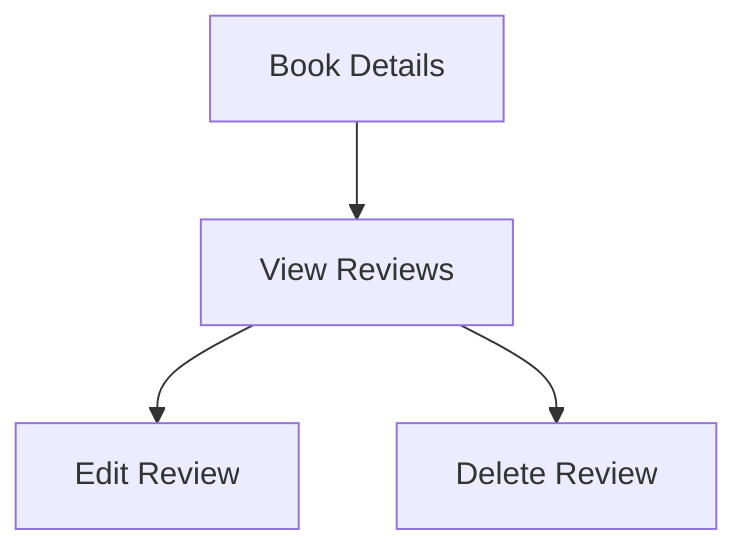
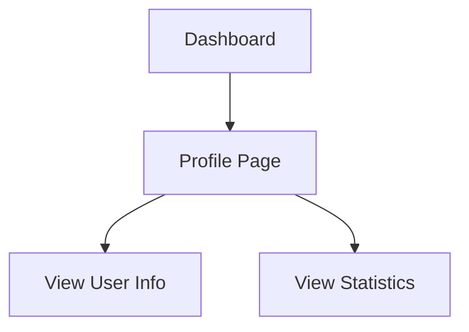
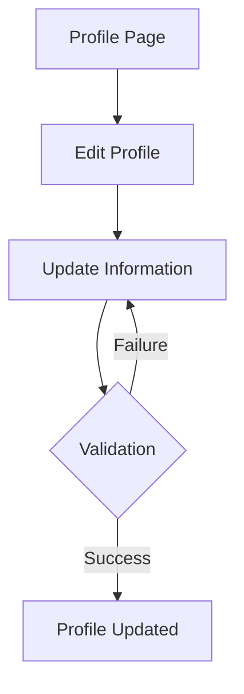
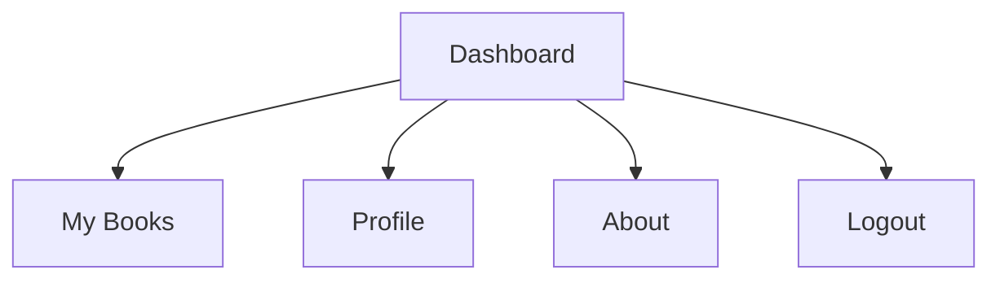

# BookBuddy User Flow Documentation

## 1. Authentication Flow

### 1.1 User Registration

**Steps:**
1. User visits the landing page
2. Clicks "Sign Up" button
3. Fills in registration form with:
   - Name
   - Email
   - Password
4. System validates input
5. On success: Account created and redirected to login
6. On failure: Shows validation errors

### 1.2 User Login

**Steps:**
1. User enters email and password
2. System validates credentials
3. On success: Redirected to dashboard
4. On failure: Shows error message

## 2. Book Management Flow

### 2.1 Adding a New Book

**Steps:**
1. User clicks "Add New Book"
2. Fills in book details:
   - Title
   - Author
   - Genre
   - Notes (optional)
3. System validates input
4. On success: Book added to collection
5. On failure: Shows validation errors

### 2.2 Managing Books

**Steps:**
1. User views their book collection
2. Can perform actions:
   - Edit book details
   - Delete book
   - View detailed information
   - Add reviews

## 3. Review Management Flow

### 3.1 Adding a Review

**Steps:**
1. User views book details
2. Clicks "Add Review"
3. Enters review information:
   - Rating (1-5)
   - Comment
4. System validates input
5. On success: Review added
6. On failure: Shows validation errors

### 3.2 Managing Reviews

**Steps:**
1. User views book reviews
2. Can perform actions:
   - Edit their reviews
   - Delete their reviews

## 4. Profile Management Flow

### 4.1 Viewing Profile

**Steps:**
1. User accesses profile page
2. Views:
   - Personal information
   - Book collection stats
   - Review activity

### 4.2 Editing Profile

**Steps:**
1. User clicks "Edit Profile"
2. Updates information:
   - Name
   - Email
   - Password (optional)
3. System validates changes
4. On success: Profile updated
5. On failure: Shows validation errors

## 5. Navigation Flow

### 5.1 Main Navigation

**Steps:**
1. User can navigate between:
   - Dashboard
   - My Books
   - Profile
   - About page
   - Logout

## 6. Error Handling

### 6.1 Common Error Scenarios
1. **Authentication Errors**
   - Invalid credentials
   - Session expiry
   - Unauthorized access

2. **Validation Errors**
   - Invalid input data
   - Missing required fields
   - Duplicate entries

3. **System Errors**
   - Database connection issues
   - Server errors
   - Network problems

## 7. Security Measures

### 7.1 Implemented Security Features
1. **Authentication**
   - Secure password handling
   - Session management
   - Login attempt limiting

2. **Authorization**
   - User-specific access control
   - Resource ownership validation
   - CSRF protection

3. **Data Protection**
   - Input sanitization
   - SQL injection prevention
   - XSS protection 